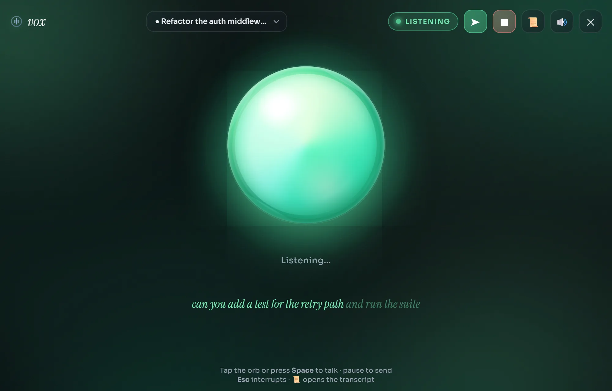
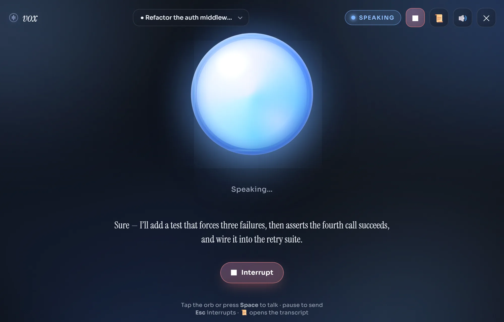
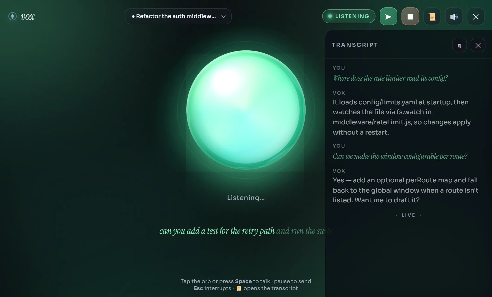

<div align="center">

# Vox

**A hands-free voice panel for any GitHub Copilot CLI session — talk to the agent out loud and hear it reply.**

[](https://aasis21.github.io/vox/)
[](LICENSE)


<br/>



</div>

Vox is a Copilot CLI extension. Run `/vox` and a reactive listening orb opens in
its own window: speak your turn, the active session hears it, and the reply is
read back to you. Voice in, voice out — no editor, no tab-juggling, just talk.

**→ See it in action at [aasis21.github.io/vox](https://aasis21.github.io/vox/)**

> Sibling project to [`aasis21/engram`](https://aasis21.github.io/engram/) and
> [`aasis21/Anya`](https://aasis21.github.io/Anya/).

---

## Features

- **Voice in / voice out** — your microphone streams straight into the active
  Copilot session, and the agent's reply is synthesized and read aloud.
- **A reactive orb** — one living orb tells you everything: periwinkle at rest,
  green while it hears you, amber while it thinks, blue while it speaks. It pulses
  with your mic level so you always know you're being heard.
- **Hands-free flow** — if mic permission is already granted, Vox opens straight
  into listening. Speak your turn and it sends automatically after a short pause,
  or tap the orb / press `Space` to send now.
- **Interrupt to talk** — tap the orb, press `Esc`, or hit Interrupt while the
  agent is speaking to cut it off and drop straight back into listening — no
  re-clicking the mic.
- **Live captions** — your speech streams in as interim text and commits as you go.
- **Speaks your typed replies too** — type directly into the Copilot CLI (not just
  voice) and Vox reads the assistant's reply aloud in the panel.
- **Transcript panel** — open the 📜 panel to read the full back-and-forth; close
  or clear it anytime.
- **Session routing + auto-switch** — the centered dropdown shows each live session;
  many can be live at once, and running `/vox` from another session automatically
  switches the open window to it.
- **Standalone app window** — opens as its own chrome-less desktop-style window
  (via Chrome/Edge app mode), not a browser tab, so the Web Speech APIs just work.
- **Cross-platform** — pure JavaScript, no build. One-line install on Windows,
  macOS, and Linux.

---

## Screenshots

| Listening | Speaking | Transcript |
|:---:|:---:|:---:|
|  |  |  |
| Green orb, pulsing with your mic. | Blue orb reading the reply — press `Esc` to barge in. | The full conversation, live, in a slide-in panel. |

---

## Quick start

Requires the **GitHub Copilot CLI** — the
[`copilot`](https://www.npmjs.com/package/@github/copilot) command
(`npm install -g @github/copilot`) — plus **Node.js** and **git** on PATH. Run from any shell:

**Windows (PowerShell):**

```powershell
irm https://raw.githubusercontent.com/aasis21/vox/main/install.ps1 | iex
```

**macOS / Linux (bash):**

```bash
curl -fsSL https://raw.githubusercontent.com/aasis21/vox/main/install.sh | bash
```

That will:
1. Clone the repo to `~/vox` (or update it if already there).
2. Copy the extension into `~/.copilot/extensions/vox`, where Copilot CLI auto-discovers it.

Then start a Copilot session and run `/vox`. Tap the orb or press `Space`, speak
your turn, and pause to send — the reply is read back to you.

## Commands

| Command | What it does |
|---------|--------------|
| `/vox` | Start Vox voice mode and make this session the active voice target. Opens the UI as its own desktop-style window via Chrome/Edge app mode (falls back to `http://localhost:4321`). Tap the orb. |
| `/vox-stop` | Stop Vox for this session and release its voice server. |
| `/vox-who` | List live Vox sessions and show which one is active. |

## Manual install / dev

From a local clone:

```powershell
.\setup.ps1            # Windows: copy into ~/.copilot/extensions/vox
```

```bash
./setup.sh             # macOS/Linux: copy into ~/.copilot/extensions/vox
```

## Uninstall

```powershell
.\uninstall.ps1        # Windows
```

```bash
./uninstall.sh         # macOS/Linux
```

## How it works

A `/vox` command spins up a small local server on port `4321` and registers the
session in `registry.json`. The browser canvas streams microphone audio in and
plays synthesized replies out, routing spoken turns to the active session. A
persistent `/listen` channel also streams replies from **typed** CLI turns to the
panel so they're spoken too.

Many sessions can be live at once; `/vox-who` shows which one is active. Running
`/vox` from another session sets a monotonic focus token, so the already-open
window switches to whichever session asked for it last — no duplicate windows.

`/vox` opens the panel as a standalone, chrome-less window using an installed
Chromium browser in app mode (Chrome preferred, then Edge) — this keeps the
browser's Web Speech APIs working, which Electron and native webviews don't. The
window uses a dedicated profile (`~/.copilot/vox-app-profile`) so it has its own
identity and remembers the mic permission. Override the browser with
`VOX_BROWSER=chrome|edge|brave|chromium` or a full path to an executable.

## License

Licensed under the [MIT License](LICENSE).
